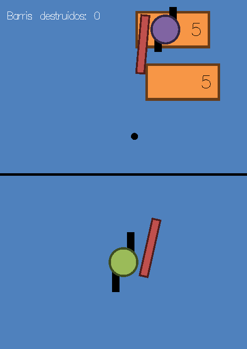

# 🎯 Barrel Assault

**Barrel Assault** é um jogo 2D interativo desenvolvido em C++ com OpenGL e GLUT, onde o jogador deve sobreviver e destruir barris que rolam em sua direção. Alguns barris podem conter inimigos armados, aumentando o desafio!

<div align="center">
  
</div>

## 📜 Sobre o Jogo

O jogador controla um personagem equipado com uma arma, que pode se movimentar e atirar nos barris. Cada barril tem uma resistência específica e será destruído ao ser atingido um número suficiente de vezes. Se um barril atingir o jogador, ou se ele for atingido por um inimigo, o jogo termina. O objetivo é sobreviver e destruir um número predefinido de barris para vencer.

## 🕹️ Controles

- **Movimento:**
  - `W` → Avançar
  - `S` → Recuar
  - `A` → Mover para a esquerda
  - `D` → Mover para a direita

- **Tiro:**
  - Botão esquerdo do mouse → Disparar
  - Movimento do mouse → Controla a rotação da arma

## 📦 Configuração

O jogo permite personalizar diversos parâmetros através do arquivo `configuracoes.xml`, como:

- Dimensões da arena
- Velocidade dos barris e do jogador
- Frequência de tiros
- Número de barris necessários para a vitória

## 🛠️ Como Compilar

1. Instale as bibliotecas necessárias (`OpenGL`, `GLUT` e `TinyXML`).
2. No terminal, execute:

   ```sh
   make all
   ```

3. Para rodar o jogo:

   ```sh
   ./main
   ```

4. Para limpar os arquivos compilados:

   ```sh
   make clean
   ```

## 📌 Recursos Utilizados

- **Linguagem:** C++
- **Gráficos:** OpenGL + GLUT
- **Configurações:** TinyXML para parsing de XML

## 🏆 Objetivo

- Destruir **N** barris para vencer!
- Sobreviver aos ataques dos inimigos!
- Melhorar a pontuação a cada jogada!

## 📜 Licença

Este projeto é de uso acadêmico e foi desenvolvido para a disciplina de Computação Gráfica da UFES.
